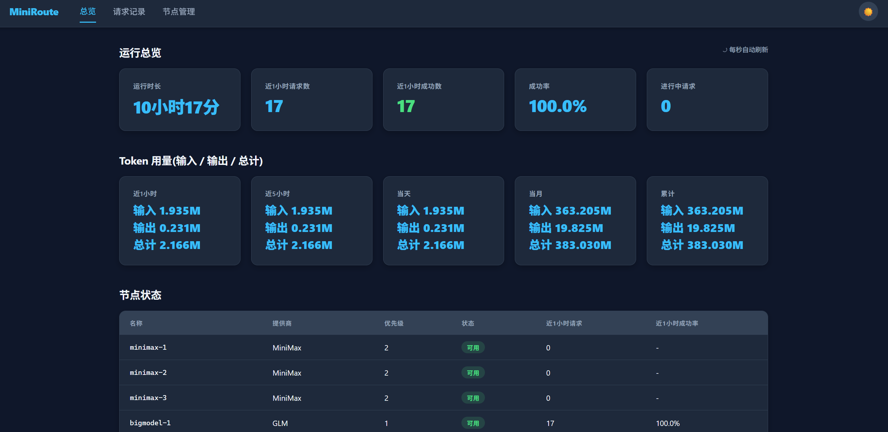
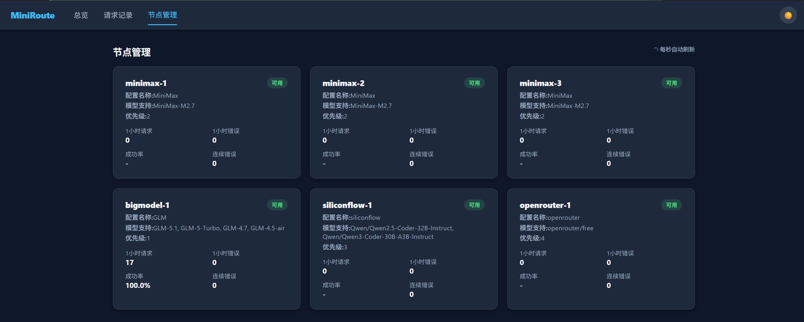
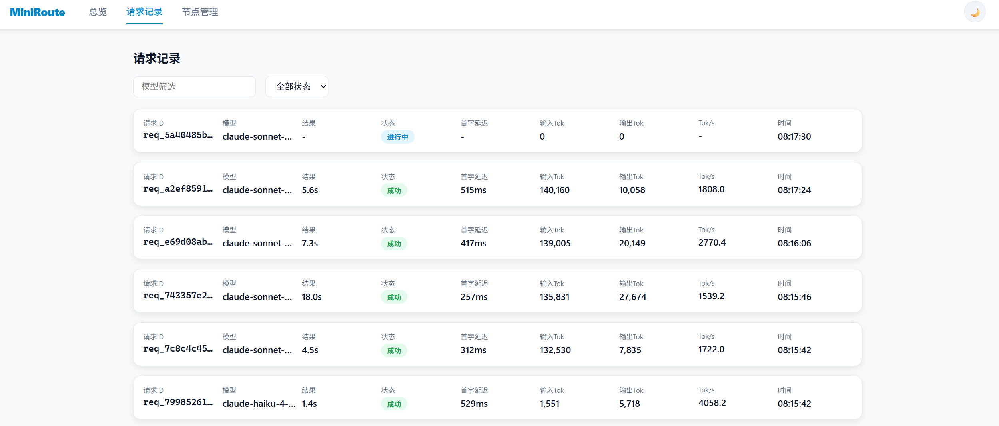

# MiniRoute

Claude (Anthropic 协议) 透传代理.将 Claude 模型请求路由到多个后端 LLM 提供商,支持优先级调度和自动故障转移.

为什么不直接用 OmniRoute?因为它做的是协议重写(把 Anthropic 协议转成 OpenAI 协议再转发),兼容性时常出问题.MiniRoute 则是纯透传--原封不动地把请求转发给同样兼容 Anthropic 协议的后端,不碰协议层,稳定得多.

除了前端页面外,后端全部手撸.

## 启动

```bash
cp config.example.yaml config.yaml   # 编辑填入 API Key
go run ./cmd/miniroute
```

## 截图

| 总览 | 节点管理 |
|:---:|:---:|
|  |  |



## 配置说明

配置文件为 `config.yaml`,模板见 `config.example.yaml`.

```yaml
server:
  listen: "0.0.0.0:20128"           # 代理监听地址
  admin_listen: "0.0.0.0:20129"     # 管理 API 地址
  request_timeout_ms: 300000        # 请求超时 (ms)

storage:
  sqlite_path: "./data/miniroute.db"
  max_parse_body_bytes: 16777216    # 最大请求体 (16 MB)

policy:
  scheduler: "sequential"           # sequential (按优先级) | random (随机)
  retry: 1                          # 失败重试次数

model_routes:
  default: ["MiniMax-M2.7"]         # 未匹配时的默认模型
  routes:
    - from: "claude-sonnet-*"       # 支持通配符 *
      to: ["MiniMax-M2.7", "GLM-5.1"]

endpoints:
  - name: "example"
    api_key: "your-api-key"
    allow_model: ["MiniMax-M2.7"]
    provider: "MiniMax"             # 自动匹配 Base URL
    rank: 1                         # 优先级, 越小越高
    alt_rank: 2                     # 高峰期优先级 (可选)
    enabled: true
```

### provider 对应的 Base URL

| provider | Base URL |
|----------|----------|
| `MiniMax` | `https://api.minimaxi.com/anthropic` |
| `GLM` | `https://open.bigmodel.cn/api/anthropic` |
| `siliconflow` | `https://api.siliconflow.cn/` |
| `openrouter` | `https://openrouter.ai/api` |
